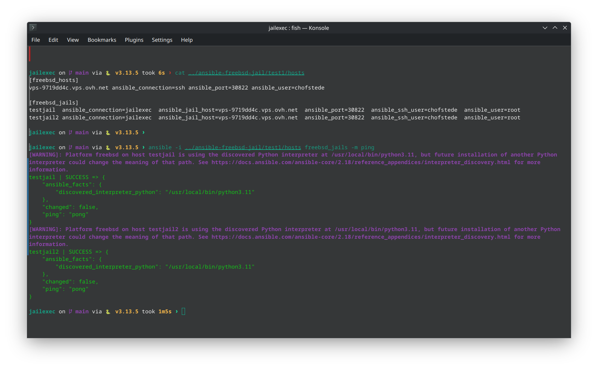

# Ansible FreeBSD Jail Connection Plugin

[](https://opensource.org/licenses/BSD-2-Clause)
[](https://www.python.org/downloads/)
[](https://docs.ansible.com/)
[](https://github.com/chofstede/ansible_jailexec/actions)

A robust Ansible connection plugin that enables task execution inside FreeBSD jails by connecting to the jail host via SSH and using `jexec` to run commands within the jail container.

## Features

- 🔒 **Secure**: Input validation, path sanitization, and shell injection protection
- 🚀 **Performant**: Connection pooling and jail root path caching
- 🛡️ **Robust**: Comprehensive error handling with retry logic and detailed error messages
- 🔧 **Flexible**: Support for both `doas` and `sudo` privilege escalation
- 📁 **File Transfer**: Two-stage file transfers with proper permission handling
- 🧪 **Well-Tested**: Comprehensive unit test suite with 85%+ code coverage
- 📖 **Well-Documented**: Extensive documentation and examples

## Demo



*The plugin in action: executing Ansible tasks inside FreeBSD jails via the jailexec connection plugin*

## Requirements

- **Control Machine**: Python 3.8+, Ansible 2.9+
- **Jail Host**: FreeBSD system with running jails
- **Privileges**: SSH access with `doas` or `sudo` configured for jail management
- **Commands**: `jls`, `jexec` available on jail host

## Installation

### Option 1: Manual Installation

```bash
# Download the plugin
curl -O https://raw.githubusercontent.com/chofstede/ansible_jailexec/main/jailexec.py

# Install to user plugins directory
mkdir -p ~/.ansible/plugins/connection/
cp jailexec.py ~/.ansible/plugins/connection/

# Or install system-wide (requires sudo)
sudo mkdir -p /usr/share/ansible/plugins/connection/
sudo cp jailexec.py /usr/share/ansible/plugins/connection/
```

### Option 2: Project-Specific Installation

```bash
# Create plugins directory in your Ansible project
mkdir -p connection_plugins/
cp jailexec.py connection_plugins/
```

### Option 3: Ansible Configuration

Add to your `ansible.cfg`:

```ini
[defaults]
connection_plugins = /path/to/connection_plugins
```

## Quick Start

### 1. Configure Inventory

Create an inventory file (`hosts.ini`):

```ini
[freebsd_hosts]
jail-host.example.com ansible_connection=ssh ansible_user=admin ansible_port=22

[freebsd_jails]
web-jail    ansible_connection=jailexec  ansible_jail_host=jail-host.example.com  ansible_user=root
db-jail     ansible_connection=jailexec  ansible_jail_host=jail-host.example.com  ansible_user=root
app-jail    ansible_connection=jailexec  ansible_jail_host=jail-host.example.com  ansible_user=app
```

### 2. Test Connection

```bash
# Test connectivity to jails
ansible -i hosts.ini freebsd_jails -m ping

# Expected output:
# web-jail | SUCCESS => {
#     "changed": false,
#     "ping": "pong"
# }
```

### 3. Run Commands

```bash
# Execute commands in jails
ansible -i hosts.ini freebsd_jails -m command -a "uname -a"

# Install packages
ansible -i hosts.ini freebsd_jails -m community.general.pkgng -a "name=nginx state=present"
```

## Configuration Reference

### Required Variables

| Variable | Description | Example |
|----------|-------------|---------|
| `ansible_jail_host` | FreeBSD host running the jails | `jail-host.example.com` |

### Optional Variables

| Variable | Default | Description |
|----------|---------|-------------|
| `ansible_jail_name` | `inventory_hostname` | Override jail name |
| `ansible_jail_user` | `root` | User for command execution in jail |
| `ansible_jail_privilege_escalation` | `doas` | Privilege escalation method (`doas` or `sudo`) |
| `ansible_jail_remote_tmp` | `/tmp/.ansible/tmp` | Remote temporary directory |
| `ansible_timeout` | `30` | Connection timeout in seconds |

### SSH Configuration

All standard Ansible SSH options are supported:

| Variable | Description |
|----------|-------------|
| `ansible_ssh_user` | SSH user for jail host connection |
| `ansible_ssh_port` | SSH port for jail host |
| `ansible_ssh_private_key_file` | SSH private key path |
| `ansible_ssh_common_args` | Additional SSH arguments |

## Usage Examples

### Basic Playbook

```yaml
---
- name: Configure FreeBSD Jails
  hosts: freebsd_jails
  connection: jailexec
  become: true
  
  tasks:
    - name: Install nginx
      community.general.pkgng:
        name: nginx
        state: present
    
    - name: Copy configuration
      ansible.builtin.copy:
        src: nginx.conf
        dest: /usr/local/etc/nginx/nginx.conf
        backup: true
      notify: restart nginx
    
    - name: Start and enable nginx
      ansible.builtin.service:
        name: nginx
        state: started
        enabled: true
  
  handlers:
    - name: restart nginx
      ansible.builtin.service:
        name: nginx
        state: restarted
```

### Multi-Environment Setup

```ini
[production_jails]
prod-web-01   ansible_connection=jailexec  ansible_jail_host=prod-host-01.example.com
prod-web-02   ansible_connection=jailexec  ansible_jail_host=prod-host-02.example.com
prod-db-01    ansible_connection=jailexec  ansible_jail_host=prod-host-01.example.com  ansible_jail_user=postgres

[staging_jails]
stage-web-01  ansible_connection=jailexec  ansible_jail_host=stage-host.example.com
stage-db-01   ansible_connection=jailexec  ansible_jail_host=stage-host.example.com

[development_jails]
dev-web-01    ansible_connection=jailexec  ansible_jail_host=dev-host.example.com  ansible_jail_privilege_escalation=sudo
```

## FreeBSD Host Setup

### 1. Install Required Packages

```bash
# Install doas (recommended) or ensure sudo is available
pkg install doas

# Or for sudo
pkg install sudo
```

### 2. Configure Privilege Escalation

#### Using doas (recommended):

```bash
# Add to /usr/local/etc/doas.conf
echo "permit nopass ansible as root cmd jls" >> /usr/local/etc/doas.conf
echo "permit nopass ansible as root cmd jexec" >> /usr/local/etc/doas.conf
echo "permit nopass ansible as root cmd mkdir" >> /usr/local/etc/doas.conf
echo "permit nopass ansible as root cmd mv" >> /usr/local/etc/doas.conf
echo "permit nopass ansible as root cmd rm" >> /usr/local/etc/doas.conf
```

#### Using sudo:

```bash
# Add to /usr/local/etc/sudoers (use visudo)
ansible ALL=(root) NOPASSWD: /usr/sbin/jls, /usr/sbin/jexec, /bin/mkdir, /bin/mv, /bin/rm
```


## Development

### Running Tests

```bash
# Install test dependencies
pip install -r requirements-test.txt

# Run all tests
pytest

# Run with coverage
pytest --cov=jailexec --cov-report=html

# Run specific test categories
pytest -m unit          # Unit tests only
pytest -m security      # Security tests only
pytest -m integration   # Integration tests only
```

### Code Quality

```bash
# Format code
black jailexec.py

# Sort imports
isort jailexec.py

# Lint code
flake8 jailexec.py
pylint jailexec.py
```

### Testing Your Changes

```bash
# Syntax check
python3 -m py_compile jailexec.py

# Test with real jail (requires FreeBSD environment)
ansible -i test-inventory test-jails -m setup
```

## Troubleshooting

### Common Issues

#### 1. "No jail host specified"

**Cause**: Missing `ansible_jail_host` configuration.

**Solution**: Add `ansible_jail_host=your-freebsd-host.com` to inventory.

#### 2. "Permission denied accessing jail"

**Cause**: Privilege escalation not configured properly.

**Solutions**:
- Verify `doas` or `sudo` configuration
- Check SSH user has necessary permissions
- Test manually: `doas jls` or `sudo jls`

#### 3. "Jail 'name' not found"

**Cause**: Jail doesn't exist or isn't running.

**Solutions**:
- List running jails: `jls`
- Start jail: `service jail onestart jail-name`
- Check jail configuration in `/etc/jail.conf`

#### 4. "SSH connection failed"

**Cause**: Network or SSH configuration issues.

**Solutions**:
- Test SSH manually: `ssh user@jail-host`
- Check SSH key authentication
- Verify firewall settings
- Check SSH daemon configuration

#### 5. "File transfer failed"

**Cause**: Permission or disk space issues.

**Solutions**:
- Check disk space on jail host
- Verify temporary directory permissions
- Check target directory exists and is writable

### Debug Mode

Enable verbose output for troubleshooting:

```bash
# Maximum verbosity
ansible -vvv -i hosts.ini freebsd_jails -m ping

# With connection debugging
ANSIBLE_DEBUG=1 ansible -vvv -i hosts.ini freebsd_jails -m ping
```

### Log Analysis

Connection plugin logs use the `jailexec:` prefix:

```
jailexec: Initializing connection to jail 'web-jail'
jailexec: Creating SSH connection to jail host: jail-host.example.com
jailexec: SSH connection established to jail-host.example.com
jailexec: Verifying jail access: web-jail
jailexec: Connected to jail 'web-jail' via host 'jail-host.example.com'
```

## Security Considerations

### Input Validation

The plugin validates all inputs:
- Jail names must follow FreeBSD naming conventions
- Paths are checked for traversal attempts
- Commands are validated for shell injection patterns

### Privilege Escalation

- Uses `doas` by default (more secure than `sudo`)
- Commands are properly quoted to prevent injection
- Temporary files use secure permissions (600)

### File Operations

- Two-stage file transfers prevent privilege escalation
- Temporary files are cleaned up on failure
- Path transformations prevent directory traversal

### Network Security

- Reuses existing SSH connections when possible
- Supports all SSH security features (key auth, host checking, etc.)
- No additional network ports required


## License

This project is licensed under the BSD 2-Clause License - see the [LICENSE](LICENSE) file for details.

## Acknowledgments

- FreeBSD community for excellent jail documentation
- Ansible community for plugin development guidance
- Contributors and testers who helped improve this plugin

## Support

- 🐛 **Issues**: [GitHub Issues](https://github.com/chofstede/ansible_jailexec/issues)
- 📧 **Email**: christian@hofstede.it

---

**Made with ❤️ for the FreeBSD and Ansible communities**