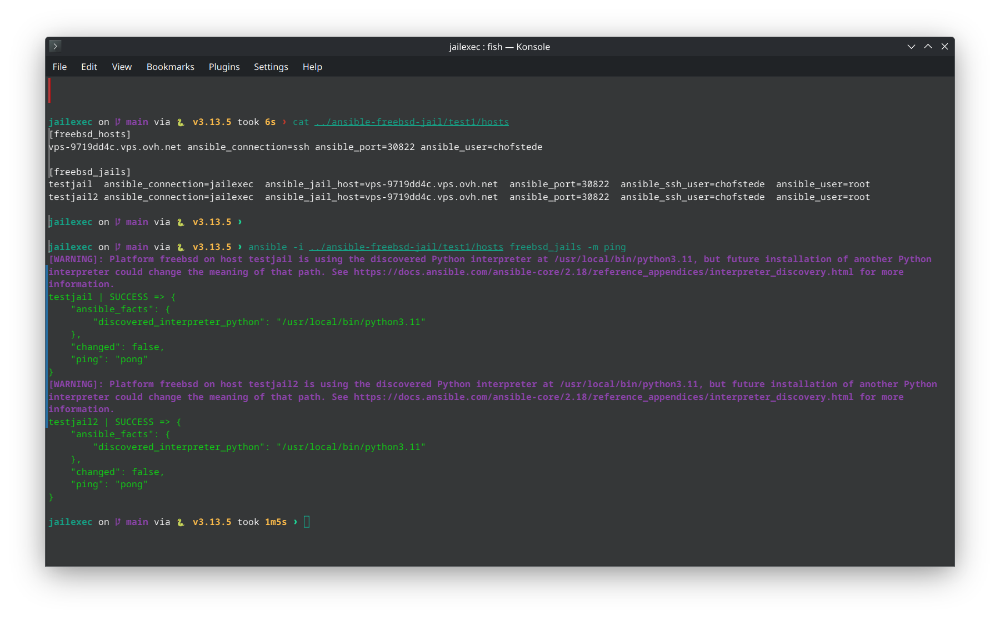

# Ansible FreeBSD Jail Connection Plugin

[](https://opensource.org/licenses/BSD-2-Clause)
[](https://www.python.org/downloads/)
[](https://docs.ansible.com/)
[](https://github.com/chofstede/ansible_jailexec/actions)

An Ansible connection plugin that runs tasks **inside a FreeBSD jail** by SSH-ing to the jail host and wrapping every command in `jexec`. You do **not** need direct SSH access to the jail itself.

The plugin inherits from Ansible's built-in `ssh` connection plugin, so every SSH option (control persist, jump hosts, key files, custom ports, etc.) works unchanged.

## Features

- **Inherits the full SSH plugin**: options are merged from the live `ssh` plugin at import time, so the plugin stays in sync with whichever `ansible-core` is installed.
- **Safe by construction**: jail names are validated, paths are traversal-checked, and every shell argument is `shlex.quote`d.
- **Lazy jail-root probe**: the on-host path of the jail is resolved only on the first file transfer, so exec-only workloads pay zero extra round trips.
- **Single round-trip `put_file`**: staged file is moved into the jail with one combined `mkdir -p && mv` command.
- **`doas` or `sudo`** for host-side privilege escalation around `jls`/`jexec`/`mkdir`/`mv`/`rm`.

## Demo


*Executing Ansible tasks inside FreeBSD jails through the `jailexec` connection plugin.*

## Requirements

- **Control machine**: Python 3.9+, `ansible-core >= 2.14`
- **Jail host**: FreeBSD with `jls` and `jexec` available, and `doas` or `sudo` configured for the SSH user
- **Jails**: must be running (so `jls -j <name> path` returns their filesystem root)

## Installation

### As a user plugin

```bash
curl -O https://raw.githubusercontent.com/chofstede/ansible_jailexec/main/jailexec.py
mkdir -p ~/.ansible/plugins/connection/
mv jailexec.py ~/.ansible/plugins/connection/
```

### As a project plugin

```bash
mkdir -p connection_plugins/
curl -o connection_plugins/jailexec.py \
     https://raw.githubusercontent.com/chofstede/ansible_jailexec/main/jailexec.py
```

Then point Ansible at it from `ansible.cfg`:

```ini
[defaults]
connection_plugins = ./connection_plugins
```

### Via pip

```bash
pip install ansible-jailexec
```

(Installs `jailexec.py` as a top-level module; Ansible's plugin loader will still need it under a `connection_plugins/` path, or set `ANSIBLE_CONNECTION_PLUGINS` to the install location.)

## Quick start

### 1. Inventory

```ini
[freebsd_jails]
web-jail  ansible_connection=jailexec  ansible_jail_host=jail-host.example.com
db-jail   ansible_connection=jailexec  ansible_jail_host=jail-host.example.com  ansible_jail_user=postgres
app-jail  ansible_connection=jailexec  ansible_jail_host=jail-host.example.com  ansible_ssh_port=30822
```

The inventory hostname (`web-jail`, `db-jail`, …) doubles as the jail name unless you override it with `ansible_jail_name`.

### 2. Ping

```bash
ansible -i hosts.ini freebsd_jails -m ping
```

Expected:

```
web-jail | SUCCESS => {
    "changed": false,
    "ping": "pong"
}
```

### 3. Run tasks

```bash
ansible -i hosts.ini freebsd_jails -m ansible.builtin.command -a "uname -a"
ansible -i hosts.ini freebsd_jails -m community.general.pkgng -a "name=nginx state=present"
```

## Configuration reference

### Plugin-specific options

| Variable | Required | Default | Description |
|----------|----------|---------|-------------|
| `ansible_jail_host` | ✅ | — | Hostname or IP of the FreeBSD host that runs the jail. |
| `ansible_jail_name` | | inventory hostname | Override the jail name if it differs from the inventory hostname. |
| `ansible_jail_user` | | `root` | User to run commands as inside the jail. |
| `ansible_jail_privilege_escalation` | | `doas` | Host-side privilege escalation for `jls`/`jexec`. One of `doas`, `sudo`. |

### SSH options

The plugin inherits **every** option of the built-in `ssh` connection plugin — `ansible_ssh_port`, `ansible_ssh_private_key_file`, `ansible_ssh_common_args`, `ansible_ssh_extra_args`, `ControlPersist`, jump hosts, and so on.

For the full list, see:

```bash
ansible-doc -t connection ssh
```

### Privilege escalation: two independent layers

There are **two** places where privileges can be escalated, and it's easy to conflate them:

1. **`ansible_jail_privilege_escalation`** (this plugin) — runs `jls`/`jexec`/`mkdir`/`mv`/`rm` **on the host** as root so the plugin can enter the jail and write into its filesystem. Default: `doas`.
2. **Ansible `become`** (`become: yes`, `--become`, `ansible_become_method`) — runs the **task payload inside the jail** under a different user. Use this if `ansible_jail_user` is non-root and the task needs root inside the jail.

Typical setup: leave `ansible_jail_user=root` (the default) and skip `become` entirely; the plugin's own privilege escalation is already enough.

## FreeBSD host setup

Add the SSH user to `doas`:

```
# /usr/local/etc/doas.conf
permit nopass ansible as root cmd jls
permit nopass ansible as root cmd jexec
permit nopass ansible as root cmd mkdir
permit nopass ansible as root cmd mv
permit nopass ansible as root cmd rm
```

or to `sudoers` (edit with `visudo`):

```
ansible ALL=(root) NOPASSWD: /usr/sbin/jls, /usr/sbin/jexec, /bin/mkdir, /bin/mv, /bin/rm
```

## Playbook example

```yaml
---
- name: Configure FreeBSD jails
  hosts: freebsd_jails
  gather_facts: true
  tasks:
    - name: Install nginx
      community.general.pkgng:
        name: nginx
        state: present

    - name: Ship configuration
      ansible.builtin.copy:
        src: nginx.conf
        dest: /usr/local/etc/nginx/nginx.conf
        backup: true
      notify: restart nginx

    - name: Enable and start nginx
      ansible.builtin.service:
        name: nginx
        state: started
        enabled: true

  handlers:
    - name: restart nginx
      ansible.builtin.service:
        name: nginx
        state: restarted
```

## Troubleshooting

Enable verbose mode:

```bash
ansible -vvv -i hosts.ini freebsd_jails -m ping
```

Plugin log lines are prefixed with `jailexec:`:

```
jailexec: jail 'web-jail' root is /jail/web-jail
jailexec: exec [web-jail]: /bin/sh -c 'echo hi'
jailexec: put_file /local/nginx.conf -> jail:/usr/local/etc/nginx/nginx.conf
jailexec: fetch_file jail:/var/log/nginx/access.log -> /tmp/access.log
```

### Common error messages

| Message | Cause | Fix |
|---------|-------|-----|
| `ansible_jail_host is not set for jail 'X'` | Missing inventory variable. | Add `ansible_jail_host=<host>` to inventory. |
| `Cannot access jail 'X': …` | `jls -j X path` failed on the host. Typically the jail isn't running or `doas`/`sudo` rejected `jls`. | `doas jls` on the host; check `service jail status`. |
| `Jail 'X' returned no filesystem root (is it running?)` | `jls` succeeded but returned blank. Jail defined but not started. | `service jail onestart X`. |
| `Invalid jail name 'X': …` | Jail name contains shell-unsafe characters or starts with `-`/`.`. | Rename, or use `ansible_jail_name` to override. |
| `Path contains '..' traversal: X` | A module tried to `put_file`/`fetch_file` with `..` in the path. | Use absolute paths without `..` segments. |
| `put_file to jail:X failed: …` | `mkdir`/`mv` into the jail root failed (permissions, full disk). | Check host-side `doas`/`sudo` rules and free space. |

## Security considerations

- **Input validation**: jail names are matched against `^[A-Za-z0-9_][A-Za-z0-9._-]*$` and length-capped at 255. Paths are rejected if any component is `..`.
- **Shell safety**: every argument crossing the SSH wire is `shlex.quote`d; the user-supplied command is the final argument to `/bin/sh -c` and is *not* further interpreted by the plugin.
- **File transfers**: files are staged in `/tmp` on the host with a random name (`ansible-jailexec-<hex>`), then moved into the jail using the configured privilege-escalation helper. On move failure, the staged file is best-effort removed.
- **No new network ports**: everything rides the existing SSH connection, including control-persist reuse.

## Development

```bash
# Install test dependencies
pip install -r requirements-test.txt

# Run the test suite with coverage
pytest

# Syntax check
python3 -m py_compile jailexec.py
```

See [`tests/integration/README.md`](tests/integration/README.md) for end-to-end tests against a real FreeBSD host.

## License

BSD 2-Clause — see [LICENSE](LICENSE).

## Support

- Issues: https://github.com/chofstede/ansible_jailexec/issues
